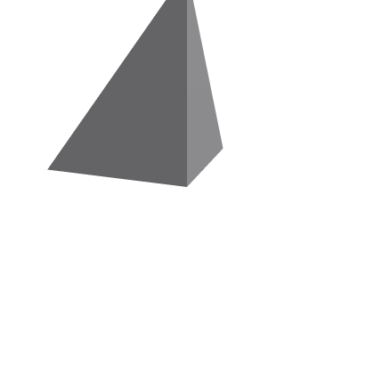

# Preconverted asset cloud acceptance — September 25, 2026

## Current publishing outcome

Jason created the private **RobloxToolchain Acceptance** experience through
Studio, universe `10767994924`, start place `99388199272385`. He explicitly
approved `universe-places:write` on the existing key restricted to that experience.
The saved key retained creator-restricted asset read/write and the previously
approved delivery scope; no other experience, billing or account-administration
permission was added. The no-fixed-expiration and owner-only key storage remained
unchanged.

Publishing the already-built native `texture-comparison.rbxl` through
`POST /universes/v1/10767994924/places/99388199272385/versions?versionType=Published`
returned HTTP 200 and `versionNumber: 4`. Downloading **that exact version** through
authenticated asset delivery produced the same SHA-256 as the local input:
`49d107ef12d8ab0aa3db4c273b157387300a9db34a23b61f31b1cda6f0c83366`.
Native decoding confirmed that the original pack ID and explicit map references
were retained. This proves the prebuilt-place publication route, not merely
model upload or a saved draft. The experience remains private.

The downloaded version was opened in an isolated Studio session, with temporary
test scripts added **only in memory**, and executed through
`StudioTestService:ExecutePlayModeAsync({test="published-materials"})`. The server
reported `isRunning: true`, `isServer: true`, successful typed mesh preloads for
all three controls and no failures; EndTest returned that result and the isolated
session exited. This is local Studio play-mode acceptance of the published bytes,
not a remote Roblox game-server session or proof of texture pixels. The corrected
probe rejects empty preload outcomes and ends on exceptions or its explicit
60-second fixture deadline. An earlier diagnostic incorrectly read the
plugin-protected ColorMap property from a server Script; it was corrected rather
than granted elevated capabilities.

An additional client-side capture test entered actual play mode and obtained
`rbxtemp://191` from the normal CaptureService API. Pixel inspection failed:
`CreateEditableImageAsync` explicitly refuses temporary texture IDs. The test
reported failure and ended; no capture-gallery access or security bypass was used.
The previous Studio/cloud-preview images remain the available visual evidence.

### Independent Studio-generated TexturePack reference

Before the CLI publication, the place that Jason published through Studio was
downloaded and inspected. Studio had cleared the pack-only control's pack
reference and assigned generated pack `79124565054263` to both mapped controls.
Downloading that generated pack yielded exactly our color descriptor's XML
content, except that the manually authored upload probe had a trailing newline.
Our actual encoder already omits that newline, matching Studio's writer.

The native payload has SHA-256
`4d944172307e81b5eae1cd515afec105220b59a62f28787434167b868d84bc57` and is retained
under `tests/fixtures/texturepack/`, with provenance. The new offline golden test
substitutes only the remote image reference with a local URI and compares the
encoder's bytes exactly. Full Rust tests, Clippy and formatting passed afterward.
This supplies independent descriptor-format evidence; it does not turn the
pack-only preview or unavailable pixel-read test into a pass.

The historical failures below describe earlier attempts. In particular, the
generic Assets API's Place failure is **not** a failure of the now-tested,
dedicated existing-place publishing API. Video remains blocked by the account's
ID-verification requirement, and direct DDS image-upload admission remains
unsupported in the tested route. No paid upload was attempted.

## Completed live tests

Uploaded already-converted bytes using the Assets API, then polled each operation
to completion. HTTP 200 with `done: false` was not treated as success. All six
assets below became Active and moderation Approved. The checked-in
`tests/fixtures/cloud-acceptance/validate.luau` then passed all six checks in
Studio `0.740.19.7400931` under Wine, with zero reported failures.

| Native artifact | Asset ID | Engine check |
| --- | --- | --- |
| Static mesh v2 | 106890661945433 | Typed MeshPart preload succeeds. A separate linked-place run also passed collision slope/empty-corner assertions using our embedded local physics payload. |
| Skinned mesh v4.01 | 139003040537777 | Typed MeshPart preload succeeds; this check does not claim animated skin deformation was visually inspected. |
| PNG | 105842817222628 | ImageLabel preload succeeds. |
| Ogg Vorbis | 89396667022461 | Sound reports loaded and decoded duration 0.2 seconds. |
| KeyframeSequence RBXM | 123669265693340 | Native retrieval preserves two keyframes, times 0 and 1, and the final Root pose's one-stud Y translation. |
| Model RBXM | 133847136766406 | InsertService loads the model and preserves AcceptanceBlock dimensions 4 × 6 × 8. |

The static mesh source hash is
`962e536394350921b27f6134eb732505cfe927a3453a9b3e44197b0206029b61`;
the skinned mesh source hash is
`2ebc3632e1028bab560378735eb0973335089bfe9cdf34e367ed94faa233d088`.
These are uploaded payload hashes, **not** hashes of remotely downloaded bytes.
Successful input admission and playback do not establish byte-preserving storage
or absence of Roblox-side processing.

### Authorized download round trips

Jason subsequently approved adding `legacy-asset:manage` to the existing key.
The official Open Cloud delivery endpoint then returned HTTP 200. Download URLs
were restricted to the returned HTTPS Roblox CDN host; the API key was not sent
to that host. HTTP gzip delivery was decoded before comparing asset bytes.

| Asset | Downloaded payload SHA-256 | Comparison |
| --- | --- | --- |
| Static mesh | `4152edf0c8585aa213391a2518d0e69ced384e7fe0071460e37af048494d767b` | Returned mesh v7.00 with COREMESH/DRACO data, not uploaded v2 bytes. |
| Skinned mesh | `4eec8d0a52cbfa0850b3330fd345c33f37920264cd6180e1cbfb9467c471061a` | Returned mesh v7.00 with COREMESH/DRACO data, not uploaded v4.01 bytes. |
| PNG | `3e40cf781518b1bccf746f6142620220069f1d652e6ce4eb172ea694b8b132b3` | PNG bytes changed; FFmpeg-decoded RGBA pixels match exactly. |
| Ogg | `def322002b3e2c1257ccecdac2274942ed5c9a3d5d4c602e9aa4ff791492e2cb` | Bytes and decoded float PCM changed; Vorbis, mono, 22050 Hz and 0.2-second duration preserved. |
| Animation RBXM | `4bc55e7d0d4413d96751886eca4bb45a61fdd587d55177d365aced6d84473143` | Exact uploaded bytes. |
| Model RBXM | `092b224a9632fb159e1ad8e6fd23f04076c68960e6de47e9824faa52c58d9778` | Exact uploaded bytes. |
| TexturePack XML | `69025b5e39d3beb732b171e2daa5b743c7ddeba0e12b0e0a799095780e9005e7` | Exact uploaded descriptor bytes. |

The two decoded RGBA streams share hash
`f31d06c072e1ac043c3c4275fc9ccaea924a3823b0de6afd75a4c816bbe4005d`.
These results establish that deployment is **not** universally byte-preserving:
local builds remain independent, but Roblox can transform delivered assets.
They do not establish v7 skinning/quantization parity or audio perceptual parity.

The skinned fixture is Rigged Simple, copyright 2017 Cesium, CC BY 4.0, converted
to Roblox mesh v4.01; see `tests/fixtures/rigged-simple.LICENSE.md`. Roblox filtered
the supplied attribution description. This disposable test asset is not a release
of that model for use in a game; retain the source attribution with test evidence.
The other uploaded fixtures are original synthetic repository test content.

## Concrete failures and incomplete acceptance

- **DDS:** BC4/ATI1 scalar DDS submitted honestly as Image with
  `image/vnd-ms.dds`. Operation `a3a20b02-a469-4a3c-85e8-ff93a8fbc0d6` completed
  with `InvalidArgument / InvalidImage`. No PNG rename, MIME disguise or cloud
  source-conversion fallback was used. This is a failed deployment route, not a
  claim that the independently tested DDS encoder is corrupt.
  Follow-up differential testing established that Studio's own image loader
  accepts our BC4, uncompressed L8 and uncompressed RGBA8 DDS outputs: all three
  returned successful preload status and `ImageLabel.IsLoaded == true` after
  attachment to a temporary CoreGui ScreenGui and a one-second fixture observation
  delay. A PNG control passed identically. An unattached ImageLabel misleadingly
  reports IsLoaded false even for the PNG, so that initial probe was discarded as
  an inadequate test of decoding. The uncompressed variants were also uploaded
  with the same correct DDS MIME type: operations
  `411e6385-2af5-4cd9-b85f-b928780350f3` (L8) and
  `f633d169-1d35-47c1-be01-2049810a2ada` (RGBA8) both completed with
  `InvalidArgument / Unsupported image format.` This distinguishes native-engine
  readability from this API's image-upload acceptance. It does not identify the
  cloud validator's internal implementation, nor prove pixel-perfect rendering.
- **TexturePack:** contrary to the upload guide's limited table, native XML
  submitted with asset type TexturePack and `application/xml` was accepted and
  approved. Initial local-reference fixture: asset 134074479993995. The properly
  remote-linked color-map fixture: asset 131343692958960. Its channel uses the
  bare numeric image ID as found in the native writer. A SurfaceAppearance place
  was built with canonical reflection property `TexturePack`; its serialized
  name is `TexturePackContentId`. However, PreloadAsync did **not** report that
  hidden pack dependency, so the pack test did not emit its PASS marker. Cloud
  admission is proved. The visual comparison below verifies explicit color-map
  rendering, but not consumption of the generated pack itself. Do not equate the
  successful mesh preload in that scene with successful TexturePack rendering.
- **Place creation:** native RBXL submitted as Place with
  `application/octet-stream` produced operation
  `2d366cb4-9b30-4c2a-ac5a-e78822dcaaae`, which ended with `Unknown / Unknown Error`.
  No test universe/place was created or game published. This does not test the
  separate existing-place publishing endpoint.
- **WebM:** Jason explicitly approved a zero-price-only probe, with
  expectedPrice 0. The locally encoded VP9 WebM request returned HTTP 403
  `PERMISSION_DENIED`, saying this account requires `IdVerification` to create
  Video assets. No operation or video asset was created and no fee was paid.
  This is an account-eligibility block before format acceptance, **not** proof
  that WebM itself is rejected. Do not substitute a paid upload or submit identity
  verification on the user's behalf.

Issue 9 remains open. The tests do not establish full game publication, PBR pack
rendering, mobile playback, or a working direct DDS/WebM publication route.

## Test-harness repair

### Gray material: an incomplete acceptance scene

The initial scene contained only `SurfaceAppearance.TexturePack`, with no
`ColorMapContent`. Engine inspection confirmed ColorMap was empty and
ColorMapContent had SourceType None. That hand-authored probe did not match the
material converter's output, which already emits both references.

An isolated three-way comparison used the same mesh and camera, full white
ambient lighting, and the same uploaded cyan image:

| Material references | Observed Studio edit-mode rendering |
| --- | --- |
| TexturePack only | Gray |
| Explicit ColorMapContent only | Cyan |
| TexturePack and explicit ColorMapContent | Cyan |

Jason supplied the desktop screenshot of the labeled comparison on September 25;
its SHA-256 is `ccfb40c41acbe608fe259567ed57dd3a2acfa597f3859e8c7bfd9a5e7753b297`.
The unrelated black always-on-top Wine/Studio window artifact is not part of the
mesh. No Rojo connection to LayerOne was made.

This isolates the gray material to the incomplete acceptance scene for this
Studio rendering path. It does **not** prove the pack was read, parsed, or used:
the explicit map also works without it. The pack-only runtime/publication path
remains unverified. In particular, do not remove explicit map properties or
claim a pack-format repair based on this screenshot.

The textured-mesh regression now follows the actual GLB material conversion,
bundle scene attachment, deployment linking, and native scene decoding. It
asserts preservation of both the explicit color map and pack reference, and
rejects deployment with the color-map binding omitted. This covers the production
path rather than treating a manually reconstructed pack-only scene as its output.

The attempted plugin screenshot-permission call returned `Feature not supported
yet.` The temporary capture plugin was removed; desktop visual evidence above
does not depend on that API. Studio sign-in was separately repaired by exposing
the existing Vinegar desktop entry in the standard per-user applications folder,
which GNOME's session could see. No credential or Wine security changes were made.

Follow-up native checks explain why preload was not a useful pack oracle in this
installation: `PreloadAsyncSupportTexturePack` is false. The existing flags
`DebugEnableTexturePackPreviewForAllUsages` and `TexturePackGeneratorUseRaw` are
also false; `TexturePackGeneratorUseOriginal` is true. These were read, not changed.
Studio's bundled UGC validator calls
`UGCValidationService:DoesSurfaceAppearanceMatchTexturePackAsync`, but invoking
that method from our authorized RunScript context fails with a missing
RobloxScript capability. Its `GetPropertyValue` helper has the same restriction.
No capability bypass was attempted. `RunService:Run()` itself succeeded and the
isolated simulation was stopped, but that is not proof of TexturePack rendering.

Direct unauthenticated delivery of the test pack returned 403. The documented
Open Cloud asset-delivery endpoint also returned 403 using the existing scoped
asset read/write key: download uses a separate `legacy-asset:manage` scope, as
documented in Roblox's
[asset-delivery announcement](https://devforum.roblox.com/t/creator-action-required-new-asset-delivery-api-endpoints-for-community-tools/3574403).
Do not extract a browser/Studio session credential to get around that boundary.

### Cloud-render comparison, not a pending thumbnail placeholder

Two additional original native RBXM models were uploaded with expectedPrice 0,
became Active/Approved, and their thumbnail jobs reached `Completed` before the
images were downloaded and inspected:

| Model | Asset ID | Result |
| --- | --- | --- |
| TexturePack only | 91242283009617 | Gray |
| Explicit cyan color-map control | 75514520994213 | Cyan |
| Current Content-typed TexturePackContent only | 92949490763673 | Gray; pixel file identical to the first result |

The first two model downloads exactly match the submitted RBXM files, with
hashes `1240c4a071b5295641bc6934f406c330795d936b992144bb5f75131ec63f4f02`
and `cf47d4c80e989616e2f347adfcc4a205dc3d3f5ca54ce80c03044b028c937e17`.
Thus their stored models were not silently rewritten to add/remove explicit maps.
The gray thumbnail SHA-256 is
`4a44c18c923b2cdddd51202763db492898f67af77a9718179251a83c12af1727`;
the cyan control is
`787b1f4ae9a45aa2cfe4d19188f69f1da66d3d49aec7b50a79fe7fda9daf057e`.

The pinned reflection database lacks `SurfaceAppearance.TexturePackContent`;
the third isolated diagnostic serialized the current Content-typed property
directly and verified it by native binary roundtrip. It did not fix the gray
result. No speculative product-schema migration was made on that evidence.

This is an independent cloud-render check, but not an in-game runtime proof.
Both Studio and cloud previews render the explicit map; neither tested preview
demonstrates consumption of the stored pack alone. Descriptor admission and
byte-preserving download are established; pack consumption remains unverified.
The material pipeline must continue preserving explicit map references.

The zero-price WebM request was retried after delivery access was enabled. It
still returned HTTP 403 with recourse `IdVerification`, with no operation or
asset created. The creator dashboard still has no experiences. It offers new
experience creation through Studio, while the documented publishing API targets
an existing universe/place. The supervising agent requested a one-time private
test experience because native desktop controls are unavailable in this session;
no browser/Studio session credential was extracted as an alternative.

The first mesh probe passed a URI string to PreloadAsync; Roblox interpreted it
as an image request and returned `AssetDelivery403IncorrectAssetType`. Passing
the typed MeshPart fixed that test error. This was not a mesh-upload failure.

More importantly, Roblox catches exceptions thrown inside the preload callback.
An assertion there could print a failure and still reach a misleading PASS later.
The maintained fixture records callback outcomes, then asserts **after**
PreloadAsync returns. It also rejects an empty outcome list. Each check records
its own result, and any failed check prevents the final PASS marker. The Rust
fake-engine regression exercises this exact fixture with callback errors caught
and verifies each preload-dependent check remains failed. Launcher exit status
alone is never an acceptance result.

The maintained fixture takes IDs and audio timing tolerance from a root
StringValue named `AcceptanceConfiguration` in the test place. Its JSON fields
are `image`, `audio`, `animation`, `model`, `audioDuration`, and `audioTolerance`.
The place must also contain Workspace MeshParts named Static and Skin with their
respective remote MeshContent IDs. The IDs above are evidence for this run, not
portable defaults or access grants for other accounts. Normal CI compiles and
tests the harness without credentials or network; live execution is explicit.

## Credential and operational boundary

Jason approved an assets read/write key restricted to creator TamedTornado667
(user 11708324724), then explicitly approved removing its fixed expiration for
pipeline use. It remains subject to Roblox's 60-day inactivity expiry. The key is
stored outside this repository with owner-only file permissions; neither its
value nor a browser session credential is part of the fixtures or evidence.
It has no billing, administration or universe/place-publishing permission.
The subsequently approved `legacy-asset:manage` system has no creator restriction
control in the key editor; it is broader than the creator-restricted `assets`
read/write entries, which were preserved unchanged. The existing key was not
regenerated, its owner-only storage was retained, and its description was updated
to state the actual permissions. No other API system was added.

All admission probes declared expectedPrice 0. The failed first image submission
sent an empty stream because a directory was mistaken for an emitted file; its
operation correctly failed `InvalidArgument` rather than being counted as a
successful upload. The corrected actual PNG file produced the accepted asset.
These experiments used curl explicitly; the product CLI currently implements
local `deploy link-scene`, not an authenticated uploader or game publisher.
